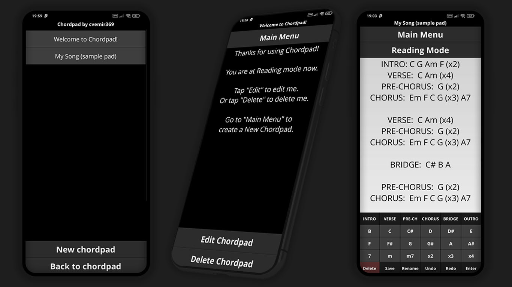

# Chordpad
**"Chordpad"** is an app made with Python and **Kivy** library.
It is a simple music chord notation text editor with an easy chord and song structure input keyboard for easier song chords notation.
It saves created pads in file-based SQL database - SQLite3.
App includes multiple screens (reading and editing mode) and full CRUD functionality.

#### Sample pad example:

